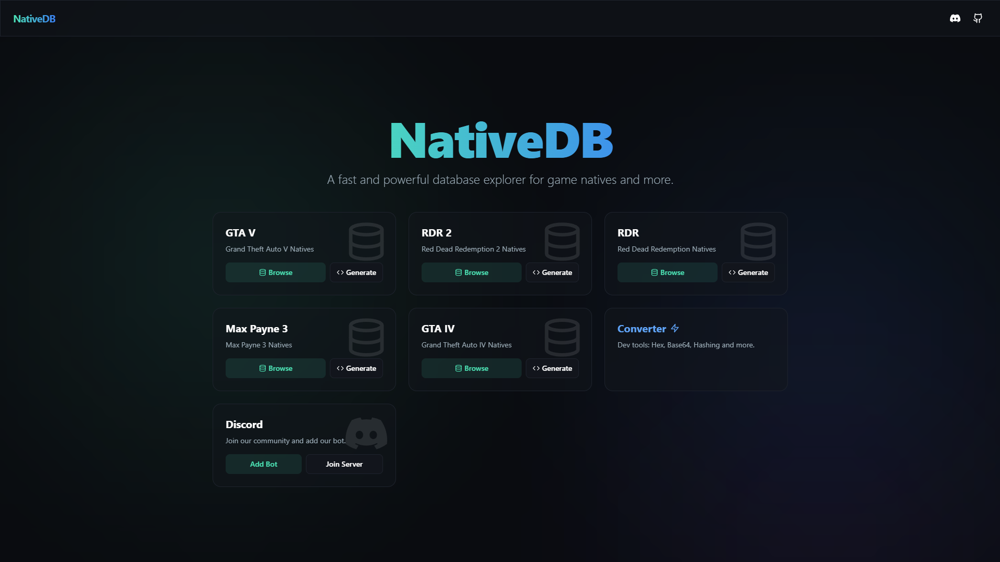
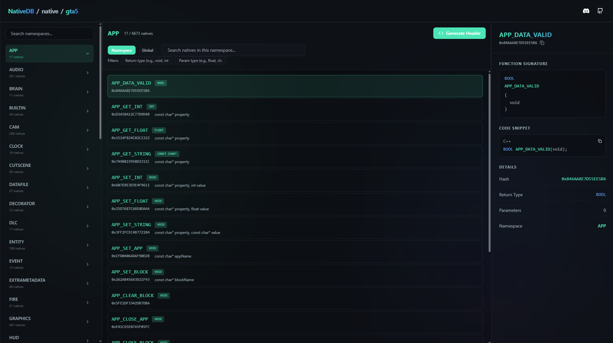
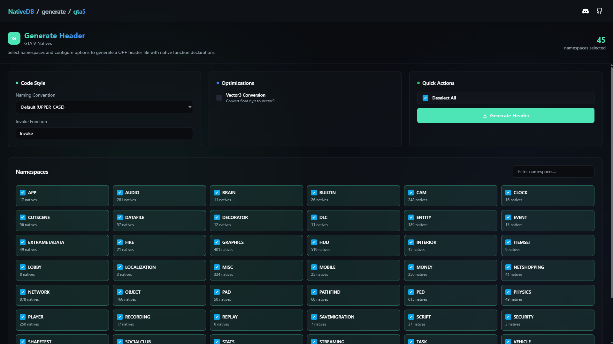
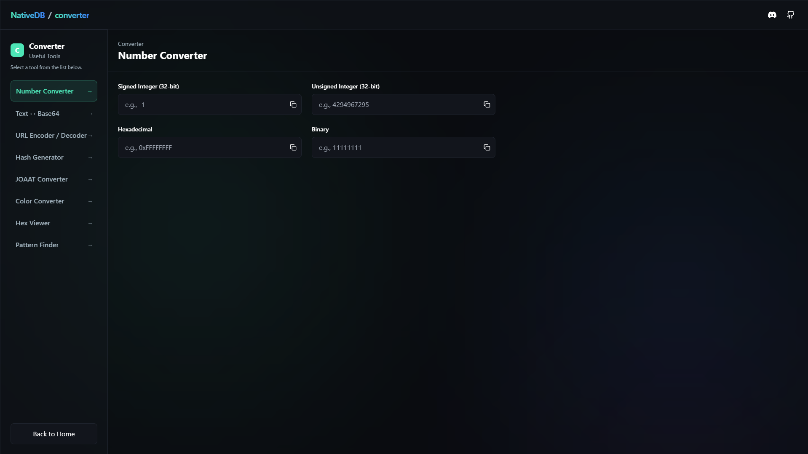

  <h1>NativeDB</h1>
  
A powerful and fast database explorer for game natives and development tools.

> NativeDB is a modern web-based application designed to simplify the exploration of native function databases for game developers. Whether you're working with GTA V, Red Dead Redemption 2, or other games, NativeDB provides an intuitive interface to discover and utilize native functions.

## 📋 Table of Contents

- [✨ Features](#-features)
- [📸 Screenshots](#-screenshots)
- [🚀 Getting Started](#-getting-started)
- [🤝 Community & Contributing](#-community--contributing)
- [📝 Changelog](#-changelog)
- [🙏 Credits](#-credits)

## ✨ Features

- **🎮 Multi-Game Support**: Explore native function databases for:
  - Grand Theft Auto V
  - Grand Theft Auto IV
  - Red Dead Redemption 2
  - Red Dead Redemption
  - Max Payne 3
- **💻 Native Generator**: Generate C++ header files from selected namespaces.
- **🛠️ Converter Tools**: A collection of developer utilities including number conversion, Base64 encoding, URL encoding, and hashing.
- **🔍 Powerful Search**: Quickly find natives by name or hash across all namespaces.
- **🌑 Modern UI**: Responsive dark-themed UI with a sleek design.

## 📸 Screenshots

### Home Page

### Native Browser

### Native Generator

### Converter Tools

## 🤝 Community & Contributing

Contributions are what make the open source community such an amazing place to learn, inspire, and create. Any contributions you make are **greatly appreciated**.

- **GitHub**: [https://github.com/Native-Database/NativeDB](https://github.com/Native-Database/NativeDB)
- **Discord**: [https://discord.gg/cyNP2bn9xE](https://discord.gg/cyNP2bn9xE)

## 📝 Changelog

**Jan 17, 2026**
- Updated project name from "Vey DB" to "NativeDB" across the application.
- Page titles are now dynamic, showing the current game (e.g., "NativeDB / GTA V").
- Added breadcrumbs to the navigation bar for easier site navigation.
- Added a Discord card to the homepage with "Add Bot" and "Join Server" links.
- Updated Discord bot link.

## 🙏 Credits

- **Alloc8or** - Data for GTAV & RDR2
- **K3rhos** - Data for RDR